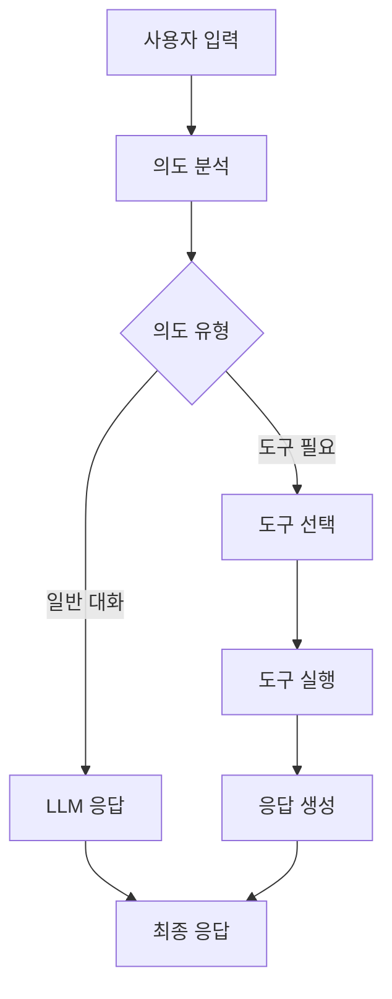

# Simple Assistant 2.0 - LangGraph 기반 스마트 개인 비서

LangGraph를 활용하여 상태 기반 그래프로 구현된 AI 에이전트입니다. 기존 simple_assistant의 모든 기능을 포함하면서도 더욱 구조화된 워크플로우를 제공합니다.

## 🌟 주요 특징

- **LangGraph 기반**: 상태 그래프를 통한 체계적인 워크플로우
- **모듈화된 구조**: 각 기능별로 명확히 분리된 노드 구조
- **동일한 기능**: 기존 simple_assistant와 완전히 동일한 기능 제공
- **향상된 확장성**: 새로운 노드 추가를 통한 쉬운 기능 확장

## 📁 프로젝트 구조

```
simple_assistant2/
├── __init__.py
├── main.py                 # CLI 실행 파일
├── app.py                  # Streamlit 웹 인터페이스
├── README.md              # 이 파일
├── graph/                 # LangGraph 관련 파일들
│   ├── __init__.py
│   ├── state.py           # 그래프 상태 정의
│   ├── nodes.py           # 그래프 노드들
│   └── graph.py           # 메인 그래프 클래스
├── utils/                 # 유틸리티
│   ├── __init__.py
│   └── tools.py           # LangChain 도구들
├── agents/                # 에이전트들 (향후 확장용)
│   └── __init__.py
└── workflows/             # 워크플로우들 (향후 확장용)
    └── __init__.py
```

## 🔄 LangGraph 워크플로우



### 처리 단계

1. **의도 분석 (analyze_intent_node)**
   - 사용자 입력에서 의도와 엔티티 추출
   - 키워드 패턴 매칭을 통한 분류

2. **도구 선택 (tool_selection_node)**
   - 분석된 의도에 따른 적절한 도구 선택
   - 일반 대화 vs 도구 사용 결정

3. **도구 실행 (tool_execution_node)**
   - 선택된 도구를 실행하여 데이터 수집
   - API 호출 및 결과 처리

4. **응답 생성 (response_generation_node)**
   - 도구 실행 결과를 바탕으로 최종 응답 생성

## 🚀 설치 및 실행

### 1. 환경 설정

```bash
# 프로젝트 루트에서
pip install langgraph langchain-openai streamlit python-dotenv

# 또는 requirements.txt가 있다면
pip install -r requirements.txt
```

### 2. API 키 설정

```bash
export OPENAI_API_KEY="your-openai-api-key"
```

### 3. CLI 실행

```bash
python src/simple_assistant2/main.py
```

### 4. 웹 인터페이스 실행

```bash
PYTHONPATH=. streamlit run src/simple_assistant2/app.py
```

## 💡 사용 예시

### 뉴스 검색
```
👤 You: 삼성전자 뉴스 찾아줘
🤖 Assistant: 삼성전자 관련 뉴스 3건:

1. 삼성전자, 3분기 실적 발표
   반도체 부문 회복세 보여...

2. 삼성전자 신제품 출시 예정
   차세대 스마트폰 기술 공개...
```

### 날씨 조회
```
👤 You: 서울 날씨 어때?
🤖 Assistant: Seoul 현재 날씨: clear sky, 온도: 15°C, 습도: 60%
👔 옷차림 추천: 가디건, 얇은 재킷 추천
```

### 주식 정보
```
👤 You: 삼성전자 주가 확인해줘
🤖 Assistant: 📈 삼성전자(005930): 71,000원
```

### 환율 정보
```
👤 You: 달러 환율 알려줘
🤖 Assistant: 💱 USD → KRW: 1320.5
```

### 일정 관리
```
👤 You: 내일 회의 일정 추가해줘
🤖 Assistant: 📅 2024-03-26에 '회의' 일정이 추가되었습니다.

👤 You: 오늘 일정 알려줘
🤖 Assistant: 📅 2024-03-25 일정 (2개):

⭕ 1. 프로젝트 리뷰
⭕ 2. 팀 미팅
```

## 🔧 지원 기능

| 기능 | 명령어 예시 | 설명 |
|------|------------|------|
| 뉴스 검색 | "삼성전자 뉴스 찾아줘" | 키워드 기반 뉴스 검색 |
| 날씨 조회 | "서울 날씨 어때?" | 현재 날씨 및 옷차림 추천 |
| 환율 조회 | "달러 환율 알려줘" | 실시간 환율 정보 |
| 주식 조회 | "삼성전자 주가 확인해줘" | 종목별 주가 정보 |
| 일정 추가 | "내일 회의 일정 추가해줘" | 날짜별 일정 추가 |
| 일정 조회 | "오늘 일정 알려줘" | 날짜별 일정 조회 |
| 일반 대화 | "안녕하세요" | 자연스러운 대화 |

## 🔍 주요 개선사항

### 1. 구조화된 워크플로우
- **기존**: 패턴 매칭 → 직접 처리
- **개선**: 의도 분석 → 도구 선택 → 실행 → 응답 생성

### 2. 상태 관리
- **기존**: 개별 함수 호출
- **개선**: 그래프 상태를 통한 체계적 데이터 전달

### 3. 확장성
- **기존**: 컨트롤러 클래스에 모든 로직
- **개선**: 노드 기반 모듈화로 쉬운 기능 추가

### 4. 디버깅
- **기존**: 중간 과정 추적 어려움
- **개선**: 각 노드별 상태 추적 가능

## 📊 성능 비교

| 항목 | Simple Assistant v1 | Simple Assistant v2 (LangGraph) |
|------|-------------------|--------------------------------|
| 구조 | 단일 컨트롤러 | 상태 그래프 |
| 확장성 | 보통 | 우수 |
| 디버깅 | 어려움 | 쉬움 |
| 상태 관리 | 제한적 | 체계적 |
| 메모리 사용 | 낮음 | 보통 |
| 복잡도 | 낮음 | 보통 |

## 🛠️ 개발자 가이드

### 새로운 노드 추가

1. `graph/nodes.py`에 새 노드 함수 추가:
```python
def new_feature_node(self, state: AssistantState) -> AssistantState:
    # 새로운 기능 구현
    state["next_action"] = "response_generation"
    return state
```

2. `graph/graph.py`에서 노드 등록:
```python
workflow.add_node("new_feature", self.nodes.new_feature_node)
```

3. 적절한 엣지 연결 추가

### 새로운 도구 추가

1. `utils/tools.py`에 새 도구 추가:
```python
@tool
def new_tool(param: str) -> str:
    """새로운 도구 설명"""
    # 도구 구현
    return result
```

2. `graph/nodes.py`에서 도구 등록 및 사용

## 🔮 향후 계획

- [ ] 멀티모달 입력 지원 (이미지, 음성)
- [ ] 대화 기록 영구 저장
- [ ] 개인화 기능 추가
- [ ] 더 정교한 감정 분석
- [ ] 실시간 알림 기능
- [ ] 플러그인 시스템

## 🤝 기여 방법

1. 이슈 등록 또는 기능 제안
2. 포크 후 개발
3. 테스트 코드 작성
4. PR 제출

## 📄 라이선스

MIT License

## 🙋‍♂️ 문의

- 이슈: GitHub Issues
- 이메일: your-email@example.com

---

**Simple Assistant v2.0** - LangGraph로 더욱 똑똑해진 개인 비서 🤖✨
